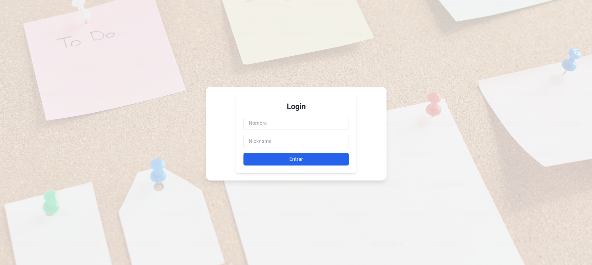
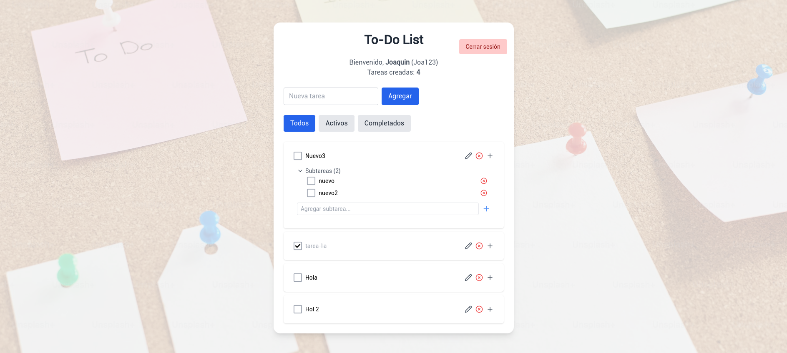

# 📝 To-Do List App

This is a simple to-do list application with support for subtasks, user login, and filtering by status (all, active, completed).

## 🚀 Features

- User login with name and nickname.
- Create, edit, and delete tasks.
- Nested subtasks per task.
- Filter by task status.
- Task counter.

## 🖼️ Screenshots

### Login Screen



---

### Main Dashboard (To-Do List)



---

## ⚙️ Tech Stack

- React
- Tailwind CSS
- Vite
- React Hook Form + Yup
- Context API (for managing user state)

## 📦 Installation

```bash
git clone https://github.com/axd3r/react-todo-list-ts.git
cd react-todo-list-ts
npm install
npm run start
```
## Install dependencies:
``` bash
npm install
```

## Start the development server:
``` bash
npm run start
```
